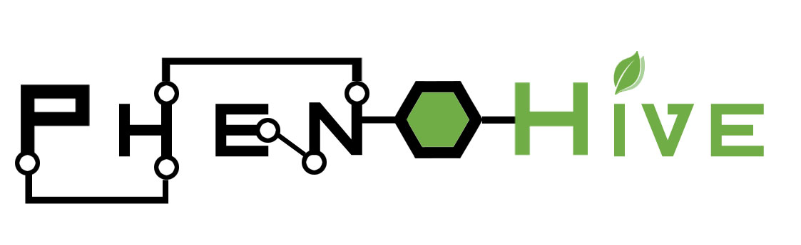

-----

# PhenoHive

Low-cost Raspberry Pi-based phenotyping station for the LBIR1251 plant biology course at UCLouvain.
Third generation — built on [Colinet 2025](https://github.com/locolinet/PhenoHive) and [Goffinet 2024](https://github.com/Oldgram/PhenoHive).

## Table of Contents

- [Project Description](#project-description)
- [System Operation](#system-operation)
  - [Configuration](#configuration)
  - [Station Identity](#station-identity)
  - [Measurement Loop](#measurement-loop)
    - [Burst Sampling and Outlier Filtering](#burst-sampling-and-outlier-filtering)
    - [Data Persistence](#data-persistence)
    - [InfluxDB Sync and Offline Queue](#influxdb-sync-and-offline-queue)
    - [Measurement Format](#measurement-format)
  - [Vision Pipeline](#vision-pipeline)
  - [Debug Web Interface](#debug-web-interface)
  - [Logging and Error Handling](#logging-and-error-handling)
- [Installation](#installation)
  - [Prerequisites](#prerequisites)
  - [OS Setup (DietPi)](#os-setup-dietpi)
  - [Automated Deployment](#automated-deployment)
  - [Manual Setup](#manual-setup)
  - [SSH Connection](#ssh-connection)
- [Development (Mock Mode)](#development-mock-mode)
- [Infrastructure (InfluxDB and Grafana)](#infrastructure-influxdb-and-grafana)

## Project Description

PhenoHive is a low-cost station for continuous plant phenotyping, designed for parallel deployment across ~20 student groups in the LBIR1251 plant biology course. Each station monitors a single potted plant over a month-long experiment in an uncontrolled environment (student homes).

The station runs on a Raspberry Pi with DietPi OS and is equipped with:
- An SHT35 sensor (I2C) to measure air temperature and relative humidity.
- A TCS3448 14-channel spectral sensor (I2C) to measure light spectrum and intensity.
- A Tal226 load cell connected to an HX711 controller (GPIO) to measure plant pot weight.
- A Raspberry Pi Camera and an LED strip controlled via a KY-019 relay module to capture plant images.

The software is written in Python and organised as follows:
- [main.py](main.py) is the entry point: it runs the measurement loop, handles sensor orchestration, and drives the two-tier collection/publish pipeline.
- [src/core/](src/core/) contains the core services: `ConfigManager`, `DataManager`, `SensorFactory`, `TimeSyncService`, and the rotating logger.
- [src/sensors/](src/sensors/) contains one module per sensor, each providing a real (`Real*`) and a mock (`Mock*`) implementation behind the `BaseSensor` interface.
- [src/ui/](src/ui/) contains the `DebugUIService`, a local HTTP server with a live dashboard and a config API.
- [src/vision/](src/vision/) contains `PlantImageProcessor`, which uses PlantCV to compute leaf area from camera images.
- [tests/](tests/) contains the pytest test suite (mock sensors only; no hardware required).
- [scripts/](scripts/) contains deployment helpers, calibration tools, and Grafana provisioning scripts.

All measurements are written to a local CSV file first, then pushed to a shared InfluxDB/Grafana stack hosted on a UCLouvain VM. Students view their data through a per-group Grafana dashboard.

## System Operation

### Configuration

All station parameters are defined in `config.ini` (copy from [config.defaults.ini](config.defaults.ini) before first run). Key sections:

| Section | Purpose |
|---------|---------|
| `[general]` | `station_id`, `mock_mode`, base interval |
| `[sampling]` | Collection and publish intervals, burst sample counts, outlier method |
| `[calibration]` | Scale re-baseline interval and drift alert threshold |
| `[influxdb]` | Remote database URL, token, org, bucket |
| `[debug_ui]` | HTTP dashboard host, port, write token |
| `[led_strip]` | GPIO pin and mock flag for the LED relay |
| `[tcs3448]` | Per-channel scale and offset calibration |

Environment variables override any config key as `SECTION_OPTION` (e.g. `INFLUXDB_TOKEN`). On the Raspberry Pi, `/opt/phenohive/.env` is loaded as an `EnvironmentFile` by the systemd unit and takes precedence over `config.ini`.

### Station Identity

Each station has a `station_id` (human-readable group label, e.g. `"1"`) and a `hardware_uuid` (UUID generated on first boot, written back to `config.ini`). Both are injected as InfluxDB tags into every record and drive the Grafana per-group access-control partitioning.

### Measurement Loop

The runtime uses a two-tier loop:

- **Collection tier** (`collection_interval_s`): reads all sensors, applies burst sampling and MAD filtering, and accumulates samples in memory.
- **Publish tier** (`publish_interval_s`): smooths the collected samples (mean, median, min, max, stddev per field) and writes one aggregate record to CSV and InfluxDB.

#### Burst Sampling and Outlier Filtering

Each collection step reads every sensor `{sensor}_samples` times (default 5). Outliers are rejected using Median Absolute Deviation (MAD) before averaging. Each published record carries quality metadata:

| Field | Description |
|-------|-------------|
| `success_ratio` | Fraction of burst reads that succeeded |
| `low_confidence` | Flag set when `success_ratio` falls below threshold |
| `quality_score` | Composite quality score (0–1) |
| `critical_quality_issue` | Boolean flag for Grafana alerting |

#### Data Persistence

Every aggregate record is appended to a local CSV file (`data/measurements.csv`) **before** any network operation. The CSV is the authoritative archive and survives InfluxDB outages.

#### InfluxDB Sync and Offline Queue

After writing to CSV, the runtime attempts to push the record to InfluxDB. If the push fails, the record is saved to `data/offline_queue.jsonl`. On the next successful write, all queued records are flushed in order.

#### Measurement Format

Each record includes:

| Field group | Fields |
|-------------|--------|
| Temperature/humidity | `temperature`, `humidity`, `vpd` |
| Spectral | `f1`–`f8`, `fz`, `fy`, `fxl`, `nir`, `2x_vis_1`, `fd_1`, `red`, `green`, `blue`, `lux` |
| Weight | `weight_g`, `tare`, `calibration_factor` |
| Vision | `leaf_area_px`, `leaf_area_cm2` |
| Quality | `success_ratio`, `low_confidence`, `quality_score`, `critical_quality_issue` per sensor |
| Identity | `station_id`, `hardware_uuid` (InfluxDB tags) |

### Vision Pipeline

When a camera is available, the station captures a plant image and runs PlantCV-based leaf area analysis ([src/vision/image_processing.py](src/vision/image_processing.py)). A background image is captured once (via the debug UI or on first run) and used to isolate the foreground plant. Leaf area is expressed in pixels and, if the physical scale factor is configured, in cm².

### Debug Web Interface

When `debug_ui.enabled = True` in `config.ini`, a local HTTP server starts on the configured port (default 8080):

| Endpoint | Description |
|----------|-------------|
| `GET /` | Live HTML dashboard |
| `GET /api/status` | Runtime status JSON |
| `GET /api/config/editable` | Editable config fields |
| `POST /api/config` | Update a config option at runtime |
| `POST /api/camera/capture-background` | Trigger background image capture |
| `POST /api/restart` | Restart the service |

Write endpoints require `Authorization: Bearer <write_token>` (if `write_token` is set) and are blocked for non-localhost clients unless `allow_remote_writes = True`.

### Logging and Error Handling

Logs are written to `logs/phenohive.log` (rotating, configurable level). On the Raspberry Pi, `journalctl -u phenohive` provides the same output via systemd. Pass `--log-level DEBUG` to [main.py](main.py) for verbose output.

Sensor errors are non-fatal: a sensor in `ERROR` state is still polled each cycle and can recover autonomously. The runtime only aborts if a critical unrecoverable error is raised.

## Installation

### Prerequisites

- Raspberry Pi (tested on Pi Zero W 2 and Pi 4) with a microSD card (≥8 GB).
- DietPi OS (v9.x or later) — see [dietpi.com](https://dietpi.com).
- SSH key already installed on the Pi (run `bash scripts/setup_ssh_key.sh` once from your development machine).

### OS Setup (DietPi)

1. Download the latest DietPi image from [dietpi.com](https://dietpi.com/#downloadinfo).
2. Flash it to a microSD card using [Balena Etcher](https://www.balena.io/etcher/).
3. Before inserting the card, copy the files from [dietpi/](dietpi/) to the `bootfs` partition and configure Wi-Fi credentials in `dietpi-wifi.txt`.
4. Insert the card, power on the Pi, and let the first-boot setup complete.
5. Connect via SSH: `ssh root@<PI_IP>` (default password: `dietpi`).

### Automated Deployment

From your development machine (Windows or Linux), use the deploy script once the Pi is reachable over SSH:

```bash
# One-time SSH key setup (generates ~/.ssh/phenohive_rpi and installs the public key)
bash scripts/setup_ssh_key.sh

# Full deployment: apt deps, venv, systemd service setup, and code push
bash scripts/deploy_to_pi.sh

# Day-to-day: push only files changed since last commit
bash scripts/push_to_pi.sh

# Push entire project tree (after a large refactor)
bash scripts/push_to_pi.sh --all
```

The station is deployed to `/opt/phenohive/` and runs as the `phenohive.service` systemd unit. The service starts automatically at boot and restarts on failure.

After deployment, create `/opt/phenohive/.env` on the Pi with at least the InfluxDB credentials:

```ini
INFLUXDB_TOKEN=<your_write_token>
INFLUX_URL=http://100.117.27.12:8081
INFLUXDB_ORG=phenohive
INFLUXDB_BUCKET=phenohive
```

### Manual Setup

1. Ensure the Pi is connected to the internet: `ping google.com`.
2. Clone the repository: `git clone https://github.com/amontariol/Phenohive_2025-26.git /opt/phenohive`.
3. Navigate to the project folder: `cd /opt/phenohive`.
4. Install system dependencies:
   ```bash
   apt-get update && apt-get install -y \
     python3 python3-pip python3-venv \
     python3-smbus python3-rpi.gpio \
     libopenblas-dev libatlas-base-dev \
     ffmpeg python3-libcamera python3-picamera2 \
     build-essential cmake gfortran pkg-config git
   ```
5. Create and activate a virtual environment:
   ```bash
   python3 -m venv .venv
   source .venv/bin/activate
   pip install -r requirements.txt
   ```
6. Copy and edit the configuration file:
   ```bash
   cp config.defaults.ini config.ini
   nano config.ini
   ```
7. Install and enable the systemd service:
   ```bash
   cp infrastructure/systemd/phenohive.service /lib/systemd/system/
   systemctl daemon-reload
   systemctl enable phenohive.service
   systemctl start phenohive.service
   ```
8. Check the service status: `systemctl status phenohive` or `journalctl -u phenohive -n 50`.

### SSH Connection

1. Find your machine's IP using `ipconfig /all` (Windows) or `ip a` (Linux/macOS).
2. Scan the local network for the Pi:
   ```bash
   nmap -sn <YOUR_IP_RANGE>
   ```
   The Pi appears in the list with "Raspberry Pi Foundation" next to its MAC address.
3. Connect: `ssh root@<PI_IP>`. Default password: `dietpi`.
4. Close the session with `exit`.

For passwordless SSH from your dev machine, run `bash scripts/setup_ssh_key.sh` once.

## Development (Mock Mode)

All sensors have mock implementations that generate plausible data without any hardware. Enable mock mode in `config.ini`:

```ini
[general]
mock_mode = True
```

Or per sensor:

```ini
[sensors]
sht35 = mock
tcs3448 = mock
scale_hx711 = mock
```

Start the station locally:

```bash
python main.py --config config.ini

# Single measurement cycle (useful for testing)
python main.py --once

# Run the test suite (no hardware required)
pytest tests/
```

To run the full stack (InfluxDB + Grafana + a mock station) with Docker:

```bash
cp .env.example .env
# Edit .env with secrets before first run
docker compose --profile local up -d
```

Grafana is available at `http://localhost:3000` and InfluxDB at `http://localhost:8086`.

## Infrastructure (InfluxDB and Grafana)

There are two separate stacks — do not confuse them:

| Stack | Where | Grafana | InfluxDB |
|-------|-------|---------|----------|
| **VM (production)** | UCLouvain VM | `100.117.27.12:3000` | `100.117.27.12:8086` |
| **Local (dev)** | Your machine | `127.0.0.1:3000` | `127.0.0.1:8086` |

To view real station data, always use the **VM Grafana**. The local stack only receives mock data.

Grafana dashboards and provisioning configs are in [grafana/](grafana/). To provision a new station dashboard, run:

```bash
python scripts/generate_station_dashboard.py --station-id <N>
```

Access control (teams, users, per-station dashboard permissions) is managed through CSV files in [grafana/access-control/](grafana/access-control/) and applied with:

```bash
python scripts/sync_grafana_access.py
```

-----


